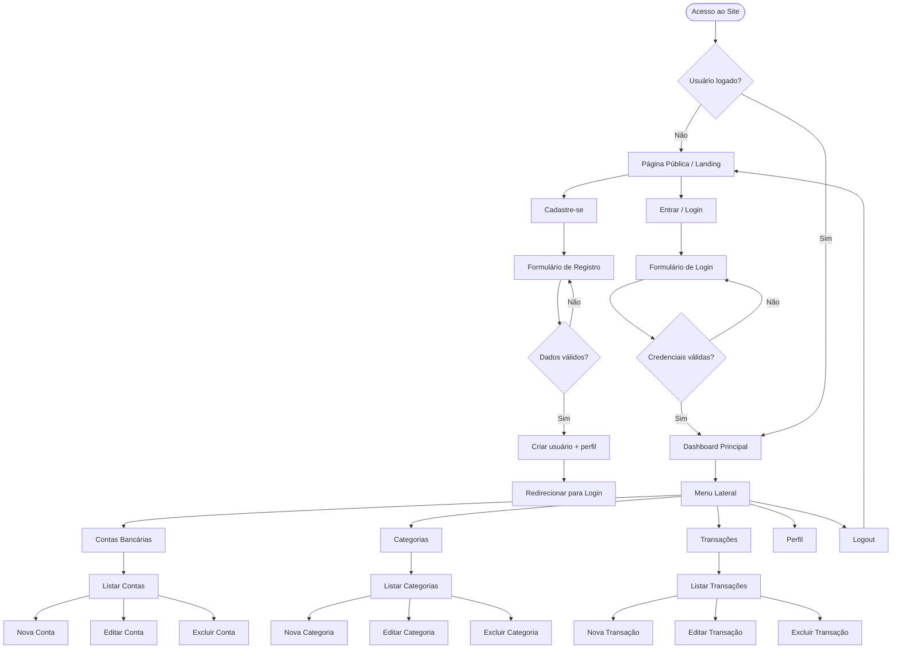
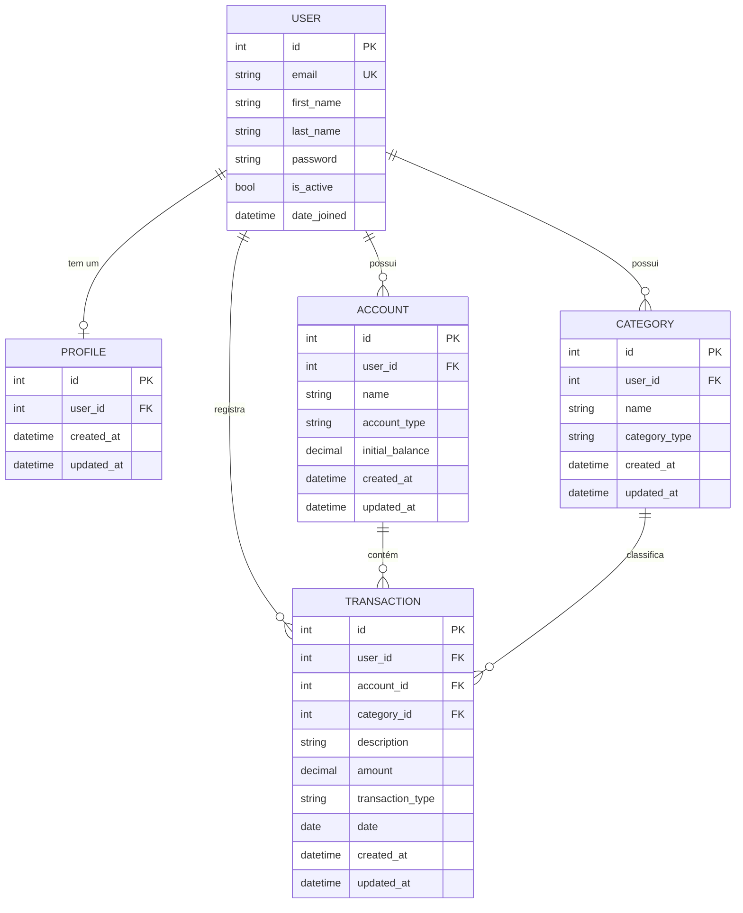

# PRD — AssistencIA
### Sistema de Gestão de Finanças Pessoais

> **Versão:** 1.0.0 | **Data:** Maio/2026 | **Status:** Em desenvolvimento

---

## 1. Visão Geral

O **AssistencIA** é um sistema web de gestão de finanças pessoais desenvolvido com Django full stack. Permite ao usuário registrar contas bancárias, categorizar transações, controlar entradas e saídas e visualizar sua saúde financeira por meio de um dashboard intuitivo. O sistema prioriza simplicidade, usabilidade e manutenibilidade, sem over engineering.

---

## 2. Sobre o Produto

| Atributo        | Detalhe                                                   |
|-----------------|-----------------------------------------------------------|
| **Nome**        | AssistencIA                                               |
| **Tipo**        | Aplicação web (SaaS pessoal)                              |
| **Stack**       | Python 3.12 · Django 5.x · SQLite · TailwindCSS           |
| **Acesso**      | Via navegador (desktop e mobile)                          |
| **Autenticação**| E-mail + senha (sistema nativo Django customizado)        |
| **Idioma da UI**| Português Brasileiro                                      |
| **Idioma do código** | Inglês                                               |

---

## 3. Propósito

Oferecer uma ferramenta pessoal, leve e funcional para que o usuário tenha controle real sobre suas finanças, registrando receitas, despesas, categorizando lançamentos e acompanhando o saldo por conta — tudo em um único lugar, sem complexidade desnecessária.

---

## 4. Público-Alvo

- Pessoas físicas que desejam organizar suas finanças pessoais.
- Usuários com familiaridade básica com internet e apps web.
- Perfil: 20–50 anos, brasileiros, qualquer nível de renda.
- Não requer conhecimento em finanças avançadas.

---

## 5. Objetivos

1. Permitir o cadastro e gerenciamento de contas bancárias pessoais.
2. Registrar transações financeiras (entradas e saídas) vinculadas a contas e categorias.
3. Categorizar lançamentos para facilitar análise de gastos.
4. Exibir dashboard com resumo financeiro (saldo total, receitas, despesas do período).
5. Garantir que cada usuário veja apenas seus próprios dados (isolamento por usuário).
6. Prover uma experiência visual moderna, responsiva e agradável.

---

## 6. Requisitos Funcionais

### 6.1 Módulo de Usuários (`users`)
- RF01 — Cadastro de novo usuário com e-mail, nome e senha.
- RF02 — Login via e-mail e senha (substituindo o username padrão do Django).
- RF03 — Logout.
- RF04 — Redirecionamento para o dashboard após login bem-sucedido.

### 6.2 Módulo de Perfis (`profiles`)
- RF05 — Criação automática de perfil ao registrar novo usuário (via signal).
- RF06 — Exibição dos dados do perfil (nome, e-mail).

### 6.3 Módulo de Contas Bancárias (`accounts`)
- RF07 — Listar contas do usuário logado.
- RF08 — Criar nova conta (nome, tipo, saldo inicial).
- RF09 — Editar dados de uma conta.
- RF10 — Excluir conta (somente se não houver transações vinculadas).

### 6.4 Módulo de Categorias (`categories`)
- RF11 — Listar categorias do usuário logado.
- RF12 — Criar nova categoria (nome, tipo: receita ou despesa).
- RF13 — Editar categoria.
- RF14 — Excluir categoria (somente se não houver transações vinculadas).

### 6.5 Módulo de Transações (`transactions`)
- RF15 — Listar transações com filtro por período, conta e categoria.
- RF16 — Registrar nova transação (descrição, valor, tipo, data, conta, categoria).
- RF17 — Editar transação existente.
- RF18 — Excluir transação.

### 6.6 Dashboard (`core`)
- RF19 — Exibir saldo total consolidado de todas as contas.
- RF20 — Exibir total de receitas e despesas do mês corrente.
- RF21 — Listar as últimas 5 transações registradas.

### 6.7 Site Público (`core`)
- RF22 — Página inicial pública com apresentação do produto.
- RF23 — Botões de "Cadastre-se" e "Entrar" visíveis na página pública.

---

### 6.8 Fluxo de UX — Diagrama Mermaid



---

## 7. Requisitos Não-Funcionais

| ID    | Requisito                                                                                          |
|-------|----------------------------------------------------------------------------------------------------|
| RNF01 | O sistema deve ser responsivo (mobile-first), utilizando TailwindCSS.                             |
| RNF02 | Toda página autenticada deve exigir login; redirecionar para login caso não autenticado.           |
| RNF03 | Cada usuário acessa apenas seus próprios dados (isolamento no nível de queryset).                  |
| RNF04 | O código deve seguir PEP8, usar aspas simples e ser escrito em inglês.                            |
| RNF05 | A UI deve ser exibida em português brasileiro.                                                    |
| RNF06 | O banco de dados será SQLite (padrão Django), sem configurações externas.                         |
| RNF07 | Toda model deve conter os campos `created_at` e `updated_at` com `auto_now_add` e `auto_now`.    |
| RNF08 | O projeto deve utilizar preferencialmente Class Based Views.                                      |
| RNF09 | Signals devem residir em `signals.py` dentro da app correspondente.                               |
| RNF10 | O sistema não deve implementar Docker ou testes automatizados nas sprints iniciais.               |
| RNF11 | O design deve suportar modo claro e escuro (dark/light mode via classe `dark` do Tailwind).       |

---

## 8. Arquitetura Técnica

### 8.1 Stack

| Camada          | Tecnologia                              |
|-----------------|-----------------------------------------|
| Linguagem       | Python 3.13+                            |
| Framework web   | Django 5.x                              |
| Banco de dados  | SQLite (django.db.backends.sqlite3)     |
| Frontend        | Django Template Language (DTL)          |
| CSS             | TailwindCSS 3.x (via CDN ou build)      |
| Ícones          | Heroicons (via SVG inline ou CDN)       |
| Controle de versão | Git + GitHub                         |

---

### 8.2 Estrutura de Dados — Diagrama Mermaid (ERD)



---

### 8.3 Estrutura de Diretórios

```
AssistencIA/
├── accounts/           # Contas bancárias
├── categories/         # Categorias de lançamentos
├── core/               # Configurações globais, URLs raiz, views públicas e dashboard
├── profiles/           # Perfis de usuário
├── transactions/       # Transações (entradas e saídas)
├── users/              # Modelo de usuário customizado (login por e-mail)
├── templates/          # Templates HTML globais
│   ├── base.html
│   ├── public/
│   │   └── home.html
│   ├── auth/
│   │   ├── login.html
│   │   └── register.html
│   ├── dashboard/
│   │   └── index.html
│   ├── accounts/
│   ├── categories/
│   └── transactions/
├── static/             # Arquivos estáticos (CSS, JS)
├── manage.py
├── db.sqlite3
└── requirements.txt
```

---

## 9. Design System

O design system do AssistencIA é baseado em TailwindCSS com tema escuro como padrão, suporte a modo claro, gradientes suaves e uma paleta coesa.

---

### 9.1 Paleta de Cores

| Token               | Dark Mode                  | Light Mode                 | Classe Tailwind (base)           |
|---------------------|----------------------------|----------------------------|----------------------------------|
| Background          | `#0f172a` (slate-950)      | `#f8fafc` (slate-50)       | `bg-slate-950 dark:bg-slate-950` |
| Surface / Card      | `#1e293b` (slate-800)      | `#ffffff`                  | `bg-slate-800`                   |
| Border              | `#334155` (slate-700)      | `#e2e8f0` (slate-200)      | `border-slate-700`               |
| Primária            | `#6366f1` (indigo-500)     | `#4f46e5` (indigo-600)     | `bg-indigo-500`                  |
| Primária hover      | `#4f46e5` (indigo-600)     | `#4338ca` (indigo-700)     | `hover:bg-indigo-600`            |
| Acento / Destaque   | `#22d3ee` (cyan-400)       | `#0891b2` (cyan-600)       | `text-cyan-400`                  |
| Sucesso             | `#34d399` (emerald-400)    | `#059669` (emerald-600)    | `text-emerald-400`               |
| Perigo              | `#f87171` (red-400)        | `#dc2626` (red-600)        | `text-red-400`                   |
| Texto principal     | `#f1f5f9` (slate-100)      | `#0f172a` (slate-950)      | `text-slate-100`                 |
| Texto secundário    | `#94a3b8` (slate-400)      | `#475569` (slate-600)      | `text-slate-400`                 |

**Gradiente de destaque (header/hero):**
```
bg-gradient-to-br from-indigo-500 via-purple-600 to-cyan-500
```

---

### 9.2 Tipografia

| Uso              | Fonte                     | Tailwind                                    |
|------------------|---------------------------|---------------------------------------------|
| Títulos (h1–h2)  | `Inter` (via Google Fonts)| `font-bold tracking-tight text-3xl`         |
| Subtítulos (h3)  | `Inter`                   | `font-semibold text-xl`                     |
| Corpo            | `Inter`                   | `text-base font-normal`                     |
| Labels / Caption | `Inter`                   | `text-sm font-medium`                       |
| Monospace        | `JetBrains Mono`          | `font-mono text-sm`                         |

```html
<!-- No base.html, no <head> -->
<link href="https://fonts.googleapis.com/css2?family=Inter:wght@400;500;600;700&display=swap" rel="stylesheet">
```

---

### 9.3 Botões

```html
<!-- Primário -->
<button class="bg-indigo-600 hover:bg-indigo-700 text-white font-semibold
               px-4 py-2 rounded-lg transition-colors duration-200">
  Salvar
</button>

<!-- Secundário (outline) -->
<button class="border border-slate-600 hover:border-indigo-500 text-slate-300
               hover:text-indigo-400 font-medium px-4 py-2 rounded-lg
               transition-colors duration-200">
  Cancelar
</button>

<!-- Perigo -->
<button class="bg-red-600 hover:bg-red-700 text-white font-semibold
               px-4 py-2 rounded-lg transition-colors duration-200">
  Excluir
</button>
```

---

### 9.4 Inputs e Formulários

```html
<!-- Input padrão -->
<input type="text"
       class="w-full bg-slate-700 border border-slate-600 text-slate-100
              placeholder-slate-400 rounded-lg px-3 py-2 text-sm
              focus:outline-none focus:ring-2 focus:ring-indigo-500
              focus:border-transparent transition-all duration-200">

<!-- Label -->
<label class="block text-sm font-medium text-slate-300 mb-1">
  Nome da conta
</label>

<!-- Select -->
<select class="w-full bg-slate-700 border border-slate-600 text-slate-100
               rounded-lg px-3 py-2 text-sm focus:outline-none
               focus:ring-2 focus:ring-indigo-500">
  <option>Corrente</option>
</select>

<!-- Mensagem de erro inline -->
<p class="text-red-400 text-xs mt-1">Este campo é obrigatório.</p>
```

---

### 9.5 Cards

```html
<div class="bg-slate-800 border border-slate-700 rounded-xl p-5 shadow-lg">
  <!-- Conteúdo do card -->
</div>
```

---

### 9.6 Layout e Grid

```html
<!-- Wrapper geral autenticado -->
<div class="min-h-screen bg-slate-950 flex">

  <!-- Sidebar -->
  <aside class="w-64 bg-slate-900 border-r border-slate-700 flex-shrink-0">
    <!-- navegação lateral -->
  </aside>

  <!-- Conteúdo principal -->
  <main class="flex-1 p-6 overflow-y-auto">
    <!-- páginas internas -->
  </main>

</div>

<!-- Grid de cards no dashboard -->
<div class="grid grid-cols-1 sm:grid-cols-2 lg:grid-cols-3 gap-4">
  <!-- cards -->
</div>
```

---

### 9.7 Menu Lateral (Sidebar)

```html
<nav class="flex flex-col gap-1 p-4">
  <a href=""
     class="flex items-center gap-3 px-3 py-2 rounded-lg text-slate-300
            hover:bg-slate-800 hover:text-indigo-400 transition-colors duration-200
            
              bg-slate-800 text-indigo-400
            ">
    <!-- ícone SVG inline -->
    Dashboard
  </a>
</nav>
```

---

### 9.8 Badges de Tipo de Transação

```html
<!-- Receita -->
<span class="inline-flex items-center px-2 py-0.5 rounded text-xs font-medium
             bg-emerald-900 text-emerald-300">
  Receita
</span>

<!-- Despesa -->
<span class="inline-flex items-center px-2 py-0.5 rounded text-xs font-medium
             bg-red-900 text-red-300">
  Despesa
</span>
```

---

## 10. User Stories

### Épico 1 — Autenticação e Acesso

| ID   | User Story                                                                                       | Critérios de Aceite                                                                                                                                                           |
|------|--------------------------------------------------------------------------------------------------|-------------------------------------------------------------------------------------------------------------------------------------------------------------------------------|
| US01 | Como visitante, quero me cadastrar com e-mail e senha para acessar o sistema.                   | - Formulário com e-mail, nome, senha e confirmação de senha. <br>- Validação de e-mail único. <br>- Senha com no mínimo 8 caracteres. <br>- Redirecionamento para login após cadastro. |
| US02 | Como usuário cadastrado, quero fazer login com meu e-mail e senha.                              | - Campo de e-mail e senha. <br>- Mensagem de erro para credenciais inválidas. <br>- Redirecionamento para o dashboard após login.                                               |
| US03 | Como usuário logado, quero fazer logout de forma segura.                                        | - Botão de logout no menu. <br>- Sessão encerrada. <br>- Redirecionamento para a página pública.                                                                               |

---

### Épico 2 — Contas Bancárias

| ID   | User Story                                                                                       | Critérios de Aceite                                                                                                                                                           |
|------|--------------------------------------------------------------------------------------------------|-------------------------------------------------------------------------------------------------------------------------------------------------------------------------------|
| US04 | Como usuário, quero cadastrar minhas contas bancárias para organizar meu dinheiro.              | - Campos: nome, tipo (corrente, poupança, carteira), saldo inicial. <br>- Conta associada ao usuário logado. <br>- Listagem imediata após criação.                              |
| US05 | Como usuário, quero editar os dados de uma conta existente.                                     | - Formulário pré-preenchido. <br>- Dados atualizados após salvar.                                                                                                             |
| US06 | Como usuário, quero excluir uma conta que não uso mais.                                         | - Confirmação antes de excluir. <br>- Bloqueio se houver transações vinculadas. <br>- Mensagem informativa de erro quando bloqueado.                                           |

---

### Épico 3 — Categorias

| ID   | User Story                                                                                       | Critérios de Aceite                                                                                                                                                           |
|------|--------------------------------------------------------------------------------------------------|-------------------------------------------------------------------------------------------------------------------------------------------------------------------------------|
| US07 | Como usuário, quero criar categorias para classificar minhas transações.                        | - Campos: nome, tipo (receita, despesa). <br>- Categoria associada ao usuário logado.                                                                                         |
| US08 | Como usuário, quero editar e excluir categorias existentes.                                     | - Edição com formulário pré-preenchido. <br>- Exclusão bloqueada se houver transações vinculadas.                                                                             |

---

### Épico 4 — Transações

| ID   | User Story                                                                                       | Critérios de Aceite                                                                                                                                                           |
|------|--------------------------------------------------------------------------------------------------|-------------------------------------------------------------------------------------------------------------------------------------------------------------------------------|
| US09 | Como usuário, quero registrar uma transação de entrada ou saída.                                | - Campos: descrição, valor, tipo, data, conta, categoria. <br>- Tipo (receita/despesa) compatível com a categoria selecionada.                                                 |
| US10 | Como usuário, quero visualizar minhas transações com filtros por período, conta e categoria.    | - Filtros aplicáveis na listagem. <br>- Resultado atualizado ao aplicar filtro.                                                                                               |
| US11 | Como usuário, quero editar e excluir transações registradas.                                    | - Formulário pré-preenchido para edição. <br>- Confirmação antes de excluir.                                                                                                  |

---

### Épico 5 — Dashboard

| ID   | User Story                                                                                       | Critérios de Aceite                                                                                                                                                           |
|------|--------------------------------------------------------------------------------------------------|-------------------------------------------------------------------------------------------------------------------------------------------------------------------------------|
| US12 | Como usuário, quero ver um resumo financeiro ao acessar o sistema.                              | - Saldo total de todas as contas. <br>- Total de receitas e despesas do mês. <br>- Últimas 5 transações listadas.                                                              |

---

## 11. Métricas de Sucesso

### 11.1 KPIs de Produto

| KPI                                   | Meta                             |
|---------------------------------------|----------------------------------|
| Tempo de carregamento do dashboard    | < 1 segundo                      |
| Taxa de erros HTTP 5xx                | < 0,1%                           |
| Cobertura de requisitos funcionais    | 100% dos RF implementados        |

### 11.2 KPIs de Usuário

| KPI                                          | Meta                                       |
|----------------------------------------------|--------------------------------------------|
| Tempo para registrar primeira transação      | < 2 minutos após cadastro                  |
| Taxa de conclusão do cadastro                | > 90%                                      |
| Clareza da navegação (sem consultar ajuda)   | Fluxo principal realizável sem instruções  |

### 11.3 KPIs de Qualidade de Código

| KPI                              | Meta                             |
|----------------------------------|----------------------------------|
| Conformidade PEP8                | 100%                             |
| Ausência de dados cross-user     | 0 vazamentos por queryset        |
| Todos os models com audit fields | 100% (`created_at`, `updated_at`)|

---

## 12. Riscos e Mitigações

| Risco                                                         | Probabilidade | Impacto | Mitigação                                                                 |
|---------------------------------------------------------------|---------------|---------|---------------------------------------------------------------------------|
| Acesso indevido a dados de outro usuário                      | Média         | Alto    | Filtrar todos os querysets por `request.user`. Usar `LoginRequiredMixin`. |
| Exclusão de conta/categoria com transações vinculadas         | Alta          | Médio   | Verificar existência de transações antes de excluir; exibir mensagem.     |
| TailwindCSS CDN indisponível                                  | Baixa         | Alto    | Documentar instrução de build local como alternativa.                     |
| Crescimento excessivo do escopo nas sprints                   | Média         | Médio   | Manter o PRD como referência; rejeitar features não documentadas.         |
| Quebra de migration durante desenvolvimento                   | Média         | Médio   | Fazer backup do `db.sqlite3` antes de cada migration destrutiva.          |

---

## 13. Lista de Tarefas por Sprint

---

### 🏁 Sprint 0 — Setup e Estrutura Base

#### Tarefa 0.1 — Configuração do ambiente de desenvolvimento
- [X] 0.1.1 — Criar o diretório raiz do projeto `AssistencIA/`.
- [X] 0.1.2 — Criar e ativar o ambiente virtual Python (`python -m venv .venv`).
- [X] 0.1.3 — Instalar Django (`pip install django`).
- [X] 0.1.4 — Criar o projeto Django com `django-admin startproject core .` dentro de `AssistencIA/`.
- [X] 0.1.5 — Renomear o diretório de configurações para `core/` caso necessário, ajustar `manage.py` e `wsgi/asgi`.
- [X] 0.1.6 — Criar o arquivo `requirements.txt` com `pip freeze > requirements.txt`.
- [X] 0.1.7 — Inicializar repositório Git (`git init`, `.gitignore` para Python/Django).
- [X] 0.1.8 — Realizar o primeiro commit com a estrutura base.

#### Tarefa 0.2 — Criação das apps Django
- [X] 0.2.1 — Criar a app `users` com `python manage.py startapp users`.
- [X] 0.2.2 — Criar a app `profiles` com `python manage.py startapp profiles`.
- [X] 0.2.3 — Criar a app `accounts` com `python manage.py startapp accounts`.
- [X] 0.2.4 — Criar a app `categories` com `python manage.py startapp categories`.
- [X] 0.2.5 — Criar a app `transactions` com `python manage.py startapp transactions`.
- [X] 0.2.6 — Registrar todas as apps em `core/settings.py` dentro de `INSTALLED_APPS`.

#### Tarefa 0.3 — Configuração do TailwindCSS
- [X] 0.3.1 — Adicionar link do TailwindCSS CDN Play no template base (abordagem inicial sem build).
- [X] 0.3.2 — Criar o diretório `templates/` na raiz do projeto.
- [X] 0.3.3 — Configurar `TEMPLATES[0]['DIRS']` em `settings.py` para apontar para `templates/`.
- [X] 0.3.4 — Criar o diretório `static/` na raiz.
- [X] 0.3.5 — Configurar `STATICFILES_DIRS` em `settings.py`.

#### Tarefa 0.4 — Configuração global do settings.py
- [X] 0.4.1 — Definir `LANGUAGE_CODE = 'pt-br'`.
- [X] 0.4.2 — Definir `TIME_ZONE = 'America/Sao_Paulo'`.
- [X] 0.4.3 — Definir `USE_I18N = True` e `USE_TZ = True`.
- [X] 0.4.4 — Confirmar `DATABASES` apontando para `db.sqlite3`.
- [X] 0.4.5 — Definir `LOGIN_URL`, `LOGIN_REDIRECT_URL` e `LOGOUT_REDIRECT_URL`.

---

### ✅ Sprint 1 — Autenticação com E-mail

#### Tarefa 1.1 — Model de usuário customizado (`users`)
- [X] 1.1.1 — Criar `CustomUser` em `users/models.py` herdando de `AbstractUser`.
- [X] 1.1.2 — Definir `username = None` para remover o campo username.
- [X] 1.1.3 — Definir `email` como `unique=True` e campo obrigatório.
- [X] 1.1.4 — Definir `USERNAME_FIELD = 'email'` e `REQUIRED_FIELDS = ['first_name', 'last_name']`.
- [X] 1.1.5 — Criar `CustomUserManager` sobrescrevendo `create_user` e `create_superuser`.
- [X] 1.1.6 — Adicionar campos `created_at` e `updated_at` ao model.
- [X] 1.1.7 — Definir `AUTH_USER_MODEL = 'users.CustomUser'` em `settings.py`.
- [X] 1.1.8 — Registrar `CustomUser` no `users/admin.py` com `UserAdmin` adaptado.

#### Tarefa 1.2 — Migrations iniciais
- [X] 1.2.1 — Executar `python manage.py makemigrations users`.
- [X] 1.2.2 — Executar `python manage.py migrate`.
- [X] 1.2.3 — Criar superusuário de teste com `python manage.py createsuperuser`.

#### Tarefa 1.3 — Formulários de autenticação (`users`)
- [X] 1.3.1 — Criar `users/forms.py`.
- [X] 1.3.2 — Criar `RegisterForm` herdando de `UserCreationForm` com campos: `first_name`, `last_name`, `email`, `password1`, `password2`.
- [X] 1.3.3 — Criar `LoginForm` herdando de `AuthenticationForm` com campo `email` no lugar de `username`.

#### Tarefa 1.4 — Views de autenticação (`users`)
- [X] 1.4.1 — Criar `RegisterView` (CreateView ou View) em `users/views.py`.
- [X] 1.4.2 — Criar `CustomLoginView` herdando de `LoginView` do Django, apontando para `LoginForm`.
- [X] 1.4.3 — Configurar `CustomLogoutView` ou usar a view padrão do Django.

#### Tarefa 1.5 — URLs de autenticação
- [X] 1.5.1 — Criar `users/urls.py` com rotas: `register/`, `login/`, `logout/`.
- [X] 1.5.2 — Incluir `users.urls` no `core/urls.py`.

#### Tarefa 1.6 — Templates de autenticação
- [X] 1.6.1 — Criar `templates/base.html` com estrutura HTML base, link Tailwind, bloco `content`.
- [X] 1.6.2 — Criar `templates/auth/login.html` estendendo `base.html`, com formulário de login.
- [X] 1.6.3 — Criar `templates/auth/register.html` estendendo `base.html`, com formulário de registro.
- [X] 1.6.4 — Aplicar design system (fundo escuro, card centralizado, inputs e botões padronizados).
- [X] 1.6.5 — Testar fluxo completo: registro → login → logout.

---

### ✅ Sprint 2 — Perfil de Usuário

#### Tarefa 2.1 — Model de perfil (`profiles`)
- [X] 2.1.1 — Criar `Profile` em `profiles/models.py` com `OneToOneField` para `settings.AUTH_USER_MODEL`.
- [X] 2.1.2 — Adicionar campos `created_at` e `updated_at`.
- [X] 2.1.3 — Registrar `Profile` no `profiles/admin.py`.

#### Tarefa 2.2 — Signal de criação automática de perfil
- [X] 2.2.1 — Criar `profiles/signals.py`.
- [X] 2.2.2 — Implementar signal `post_save` em `User` para criar `Profile` automaticamente.
- [X] 2.2.3 — Conectar o signal em `profiles/apps.py` via `ready()`.

#### Tarefa 2.3 — Migrations de perfil
- [X] 2.3.1 — Executar `python manage.py makemigrations profiles`.
- [X] 2.3.2 — Executar `python manage.py migrate`.
- [X] 2.3.3 — Verificar no admin que o perfil é criado ao registrar um novo usuário.

---

### 🌐 Sprint 3 — Página Pública e Dashboard

#### Tarefa 3.1 — Página pública (`core`)
- [X] 3.1.1 — Criar `core/views.py` com `HomeView` (TemplateView) para a landing page.
- [X] 3.1.2 — Criar `templates/public/home.html` com apresentação do produto.
- [X] 3.1.3 — Incluir botões "Cadastre-se" e "Entrar" no hero da página.
- [X] 3.1.4 — Aplicar gradiente de destaque no hero (`from-indigo-500 via-purple-600 to-cyan-500`).
- [X] 3.1.5 — Garantir que a página seja acessível sem autenticação.
- [X] 3.1.6 — Configurar rota `''` (home) em `core/urls.py` apontando para `HomeView`.

#### Tarefa 3.2 — Layout autenticado base
- [ ] 3.2.1 — Criar `templates/layouts/app.html` com sidebar lateral e área de conteúdo.
- [ ] 3.2.2 — Implementar sidebar com links para: Dashboard, Contas, Categorias, Transações.
- [ ] 3.2.3 — Adicionar botão de logout na sidebar.
- [ ] 3.2.4 — Destacar visualmente o link ativo com classe condicional via DTL.
- [ ] 3.2.5 — Aplicar design system ao layout (cores slate, bordas, tipografia).

#### Tarefa 3.3 — Dashboard (`core`)
- [ ] 3.3.1 — Criar `DashboardView` (LoginRequiredMixin + TemplateView) em `core/views.py`.
- [ ] 3.3.2 — Calcular no contexto: saldo total de todas as contas do usuário.
- [ ] 3.3.3 — Calcular no contexto: total de receitas do mês corrente.
- [ ] 3.3.4 — Calcular no contexto: total de despesas do mês corrente.
- [ ] 3.3.5 — Buscar as últimas 5 transações do usuário para exibição.
- [ ] 3.3.6 — Criar `templates/dashboard/index.html` estendendo `layouts/app.html`.
- [ ] 3.3.7 — Implementar 3 cards de resumo (saldo, receitas, despesas) com cores do design system.
- [ ] 3.3.8 — Implementar tabela/lista das últimas 5 transações no dashboard.
- [ ] 3.3.9 — Configurar rota `dashboard/` em `core/urls.py`.

---

### 🏦 Sprint 4 — Contas Bancárias

#### Tarefa 4.1 — Model de conta (`accounts`)
- [ ] 4.1.1 — Criar `Account` em `accounts/models.py` com campos: `user` (FK), `name`, `account_type` (choices), `initial_balance` (DecimalField).
- [ ] 4.1.2 — Definir choices de tipo: `checking` (Corrente), `savings` (Poupança), `wallet` (Carteira).
- [ ] 4.1.3 — Adicionar campos `created_at` e `updated_at`.
- [ ] 4.1.4 — Registrar no `accounts/admin.py`.
- [ ] 4.1.5 — Executar `makemigrations accounts` e `migrate`.

#### Tarefa 4.2 — Forms de conta
- [ ] 4.2.1 — Criar `accounts/forms.py`.
- [ ] 4.2.2 — Criar `AccountForm` (ModelForm) com campos: `name`, `account_type`, `initial_balance`.
- [ ] 4.2.3 — Aplicar classes Tailwind nos widgets do formulário.

#### Tarefa 4.3 — Views de conta
- [ ] 4.3.1 — Criar `AccountListView` (LoginRequiredMixin + ListView) filtrando por `user=request.user`.
- [ ] 4.3.2 — Criar `AccountCreateView` (LoginRequiredMixin + CreateView) atribuindo `user` no `form_valid`.
- [ ] 4.3.3 — Criar `AccountUpdateView` (LoginRequiredMixin + UpdateView) verificando ownership.
- [ ] 4.3.4 — Criar `AccountDeleteView` (LoginRequiredMixin + DeleteView) com verificação de transações vinculadas e ownership.

#### Tarefa 4.4 — URLs de conta
- [ ] 4.4.1 — Criar `accounts/urls.py` com rotas: `list/`, `new/`, `<pk>/edit/`, `<pk>/delete/`.
- [ ] 4.4.2 — Incluir `accounts.urls` no `core/urls.py` com prefixo `accounts/`.

#### Tarefa 4.5 — Templates de conta
- [ ] 4.5.1 — Criar `templates/accounts/account_list.html` com tabela de contas e botões de ação.
- [ ] 4.5.2 — Criar `templates/accounts/account_form.html` com formulário de criação/edição.
- [ ] 4.5.3 — Criar `templates/accounts/account_confirm_delete.html` com confirmação de exclusão.
- [ ] 4.5.4 — Aplicar design system em todos os templates.
- [ ] 4.5.5 — Exibir mensagem de bloqueio quando a exclusão não for permitida.

---

### 🏷️ Sprint 5 — Categorias

#### Tarefa 5.1 — Model de categoria (`categories`)
- [ ] 5.1.1 — Criar `Category` em `categories/models.py` com campos: `user` (FK), `name`, `category_type` (choices: `income`/`expense`).
- [ ] 5.1.2 — Adicionar campos `created_at` e `updated_at`.
- [ ] 5.1.3 — Registrar no `categories/admin.py`.
- [ ] 5.1.4 — Executar `makemigrations categories` e `migrate`.

#### Tarefa 5.2 — Forms de categoria
- [ ] 5.2.1 — Criar `categories/forms.py` com `CategoryForm` (ModelForm): campos `name`, `category_type`.
- [ ] 5.2.2 — Aplicar classes Tailwind nos widgets.

#### Tarefa 5.3 — Views de categoria
- [ ] 5.3.1 — Criar `CategoryListView` filtrando por `user=request.user`.
- [ ] 5.3.2 — Criar `CategoryCreateView` atribuindo `user` no `form_valid`.
- [ ] 5.3.3 — Criar `CategoryUpdateView` com verificação de ownership.
- [ ] 5.3.4 — Criar `CategoryDeleteView` com verificação de transações vinculadas e ownership.

#### Tarefa 5.4 — URLs de categoria
- [ ] 5.4.1 — Criar `categories/urls.py` com rotas: `list/`, `new/`, `<pk>/edit/`, `<pk>/delete/`.
- [ ] 5.4.2 — Incluir `categories.urls` no `core/urls.py` com prefixo `categories/`.

#### Tarefa 5.5 — Templates de categoria
- [ ] 5.5.1 — Criar `templates/categories/category_list.html` com listagem e ações.
- [ ] 5.5.2 — Criar `templates/categories/category_form.html`.
- [ ] 5.5.3 — Criar `templates/categories/category_confirm_delete.html`.
- [ ] 5.5.4 — Aplicar design system em todos os templates.

---

### 💸 Sprint 6 — Transações

#### Tarefa 6.1 — Model de transação (`transactions`)
- [ ] 6.1.1 — Criar `Transaction` em `transactions/models.py` com campos: `user` (FK), `account` (FK), `category` (FK), `description`, `amount` (DecimalField), `transaction_type` (choices: `income`/`expense`), `date` (DateField).
- [ ] 6.1.2 — Adicionar campos `created_at` e `updated_at`.
- [ ] 6.1.3 — Registrar no `transactions/admin.py`.
- [ ] 6.1.4 — Executar `makemigrations transactions` e `migrate`.

#### Tarefa 6.2 — Forms de transação
- [ ] 6.2.1 — Criar `transactions/forms.py` com `TransactionForm` (ModelForm).
- [ ] 6.2.2 — Sobrescrever `__init__` para filtrar queryset de `account` e `category` pelo usuário logado.
- [ ] 6.2.3 — Incluir campos: `description`, `amount`, `transaction_type`, `date`, `account`, `category`.
- [ ] 6.2.4 — Aplicar classes Tailwind nos widgets, incluindo `DateInput` com `type="date"`.

#### Tarefa 6.3 — Views de transação
- [ ] 6.3.1 — Criar `TransactionListView` com filtro por `user`, ordenado por `date` decrescente.
- [ ] 6.3.2 — Implementar filtro por período (mês/ano) via query params GET na `TransactionListView`.
- [ ] 6.3.3 — Implementar filtro por conta e categoria via query params GET na `TransactionListView`.
- [ ] 6.3.4 — Criar `TransactionCreateView` atribuindo `user` no `form_valid`.
- [ ] 6.3.5 — Criar `TransactionUpdateView` com verificação de ownership.
- [ ] 6.3.6 — Criar `TransactionDeleteView` com confirmação e verificação de ownership.

#### Tarefa 6.4 — URLs de transação
- [ ] 6.4.1 — Criar `transactions/urls.py` com rotas: `list/`, `new/`, `<pk>/edit/`, `<pk>/delete/`.
- [ ] 6.4.2 — Incluir `transactions.urls` no `core/urls.py` com prefixo `transactions/`.

#### Tarefa 6.5 — Templates de transação
- [ ] 6.5.1 — Criar `templates/transactions/transaction_list.html` com tabela, badges de tipo e ações.
- [ ] 6.5.2 — Implementar formulário de filtros (período, conta, categoria) no topo da listagem.
- [ ] 6.5.3 — Criar `templates/transactions/transaction_form.html`.
- [ ] 6.5.4 — Criar `templates/transactions/transaction_confirm_delete.html`.
- [ ] 6.5.5 — Aplicar badges de receita/despesa com cores do design system (emerald/red).
- [ ] 6.5.6 — Aplicar design system em todos os templates.

---

### 🎨 Sprint 7 — Refinamento Visual e Polimento

#### Tarefa 7.1 — Refinamento do design system
- [ ] 7.1.1 — Revisar consistência visual em todos os templates (tipografia, espaçamentos, cores).
- [ ] 7.1.2 — Garantir responsividade em telas menores (mobile): sidebar colapsável ou menu hamburguer.
- [ ] 7.1.3 — Adicionar estado de hover e focus em todos os elementos interativos.
- [ ] 7.1.4 — Revisar todos os formulários com mensagens de erro do Django exibidas com estilo.

#### Tarefa 7.2 — Mensagens de feedback ao usuário
- [ ] 7.2.1 — Configurar Django Messages framework em `settings.py`.
- [ ] 7.2.2 — Adicionar bloco de mensagens no `layouts/app.html` para exibir feedback após ações.
- [ ] 7.2.3 — Estilizar mensagens de sucesso (emerald), erro (red) e informação (indigo) com Tailwind.

#### Tarefa 7.3 — Proteção de ownership em todas as views
- [ ] 7.3.1 — Auditar todas as views com `get_queryset` para garantir filtro por `user=request.user`.
- [ ] 7.3.2 — Auditar `get_object` nas views de detalhe/edição/exclusão para retornar 404 se não pertencer ao usuário.

#### Tarefa 7.4 — Revisão final e commit de release
- [ ] 7.4.1 — Executar verificação manual de todos os fluxos do sistema.
- [ ] 7.4.2 — Verificar conformidade PEP8 (usar `flake8`).
- [ ] 7.4.3 — Atualizar `requirements.txt`.
- [ ] 7.4.4 — Realizar commit final da v1.0.0.

---

### 🔮 Sprints Futuras (Backlog)

- **Sprint 8** — Implementação de testes automatizados (unitários e de integração).
- **Sprint 9** — Containerização com Docker e docker-compose.
- **Sprint 10** — Deploy em ambiente de produção (Railway, Render ou VPS).

---

*Documento gerado em Maio/2026 · AssistencIA v1.0.0*
