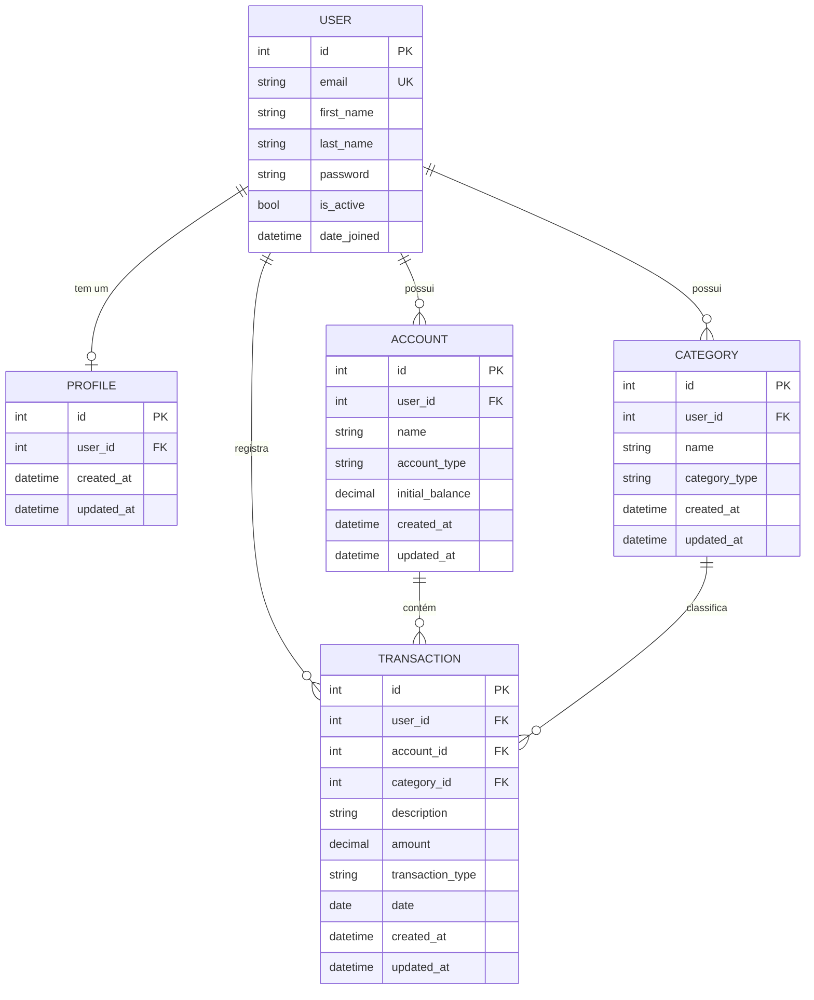

# Arquitetura do Projeto

## Estrutura de Diretórios

```
AssistencIA/
├── accounts/           # App: contas bancárias
├── categories/         # App: categorias de transações
├── core/               # Configurações do projeto (settings, urls, wsgi, asgi)
├── profiles/           # App: perfis de usuário
├── transactions/       # App: transações financeiras
├── users/              # App: modelo de usuário customizado
├── docs/               # Documentação do projeto
├── templates/          # Templates HTML globais
│   ├── base.html
│   ├── public/
│   │   └── home.html
│   ├── auth/
│   │   ├── login.html
│   │   └── register.html
│   ├── dashboard/
│   │   └── index.html
│   ├── accounts/
│   ├── categories/
│   └── transactions/
├── static/             # Arquivos estáticos — CSS, JS
├── manage.py
├── db.sqlite3
└── requirements.txt
```

## Apps

| App | Responsabilidade |
|---|---|
| `core` | Configurações globais, URLs raiz, views públicas e dashboard |
| `users` | Modelo de usuário customizado com login por e-mail |
| `profiles` | Perfil de usuário criado automaticamente via signal |
| `accounts` | Contas bancárias do usuário |
| `categories` | Categorias para classificar transações |
| `transactions` | Registro de entradas e saídas financeiras |

## Modelo de Dados (ERD)



## Roteamento de URLs

Cada app tem seu próprio `urls.py`, incluído no `core/urls.py`:

```
/                       → página pública (landing)
/dashboard/             → dashboard autenticado
/admin/                 → Django admin
/users/register/        → cadastro
/users/login/           → login
/users/logout/          → logout
/accounts/list/         → listar contas
/accounts/new/          → nova conta
/accounts/<pk>/edit/    → editar conta
/accounts/<pk>/delete/  → excluir conta
/categories/list/       → listar categorias
/categories/new/        → nova categoria
/categories/<pk>/edit/  → editar categoria
/categories/<pk>/delete/→ excluir categoria
/transactions/list/     → listar transações
/transactions/new/      → nova transação
/transactions/<pk>/edit/    → editar transação
/transactions/<pk>/delete/  → excluir transação
```

## Isolamento de dados por usuário

Todo queryset de qualquer view autenticada deve filtrar por `request.user`. Nenhuma view pode retornar dados de outro usuário.
